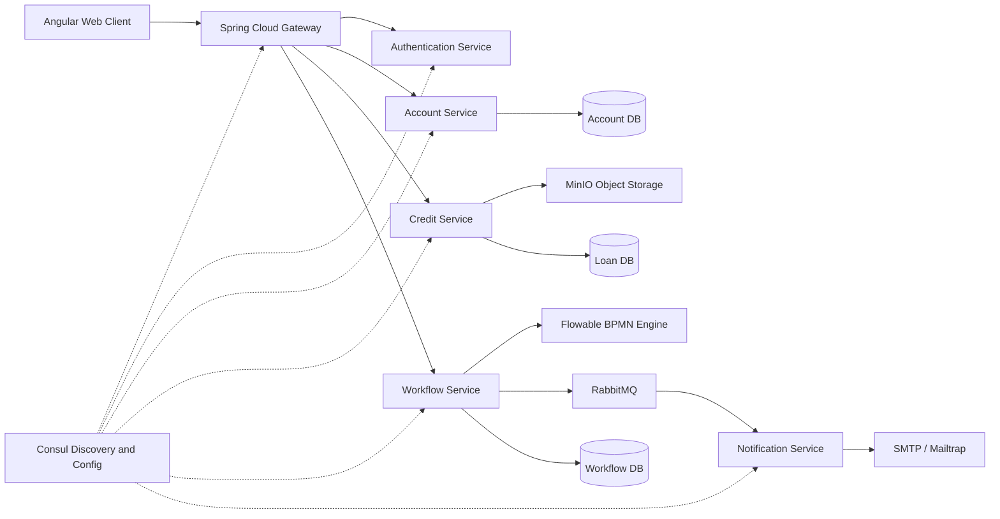

# Bank Loan System

A containerized digital loan-processing platform that orchestrates a complete credit workflow across clients and bank teams. The system combines a Spring Boot microservices backend, an Angular enterprise portal, and a Flowable BPMN process to move each request from submission to a final administrative decision.

> Internship project built at [WEVIOO](https://www.wevioo.com/)

## What It Does

The platform provides a shared workspace for four roles:

- **Clients** submit loan requests , follow progress, and view decisions.
- **Bank receptionists** review incoming requests ,upload supporting documents and complete the initial dossier.
- **Loan officers** validate documentation and write risk or credit recommendations.
- **Bank administrators** monitor the portfolio, manage users, and make the final decision.

The workflow intentionally combines automated service tasks with human approval stages. Flowable records the process state, assigns work to the appropriate role, triggers notifications, and supports the operational path from intake through approval or rejection.

## Architecture



### Services

| Service | Responsibility |
| --- | --- |
| `gateway-service` | Public entry point, routing, JWT validation, and propagation of authenticated user context |
| `oauth-service` | Custom authentication service issuing and validating JWT access and refresh tokens |
| `account-service` | Users, roles, permissions, profiles, and password recovery |
| `credit-service` | Loan applications, credit data, document metadata, and presigned document URLs |
| `workflow-service` | Flowable BPMN execution, task assignment, loan state transitions, and real-time updates |
| `notification-service` | Asynchronous email delivery from RabbitMQ events |

## Key Features

- Role-based access control for client and bank operations
- Stateless JWT authentication with access and refresh tokens
- BPMN-based human-in-the-loop loan processing
- Consul service discovery and centralized configuration
- RabbitMQ-backed asynchronous notifications
- MinIO document storage with short-lived presigned download URLs
- STOMP/WebSocket updates for workflow activity
- Separate PostgreSQL databases for account, loan, and workflow domains
- Docker Compose environment for one-command local deployment
- Angular dashboards tailored to each operational role

## Technology Stack

| Area | Technology |
| --- | --- |
| Frontend | Angular 22, TypeScript, RxJS, STOMP.js |
| Backend | Java 21, Spring Boot 3.5, Spring Cloud |
| Security | Spring Security, JWT, BCrypt |
| Workflow | Flowable 7.1, BPMN 2.0 |
| Communication | REST, RabbitMQ, STOMP/WebSockets |
| Discovery and configuration | HashiCorp Consul |
| Persistence | PostgreSQL 16, database-per-domain layout |
| Object storage | MinIO, S3-compatible storage |
| Runtime | Docker, Docker Compose, Nginx |
| Email | SMTP through Mailtrap |

## Run Locally

### Prerequisites

- Docker Desktop with Docker Compose
- Git

### Start the platform

1. Copy the environment template:

	```powershell
	Copy-Item .env.example .env
	```

2. Replace the placeholder secrets and Mailtrap values in `.env`.

3. Build and start all services:

	```powershell
	docker compose up --build
	```

4. Open the web client at [http://localhost](http://localhost).

Useful local consoles:

- Consul: [http://localhost:8500](http://localhost:8500)
- RabbitMQ Management: [http://localhost:15672](http://localhost:15672)
- MinIO Console: [http://localhost:9001](http://localhost:9001)

To stop the environment:

```powershell
docker compose down
```

## Configuration

The project uses Consul KV for shared and service-specific configuration. Docker Compose loads the selected Spring profile and injects runtime secrets from `.env`. See [.env.example](.env.example) for the required variables.

Never commit `.env` or use development credentials in a public deployment. Rotate any credential that has been exposed and use a managed secret store for cloud environments.

## Current Scope and Next Steps

This repository is a development-stage demonstration of service decomposition, workflow orchestration, authentication, document management, and asynchronous communication. The next production-hardening steps include:

- Cloud deployment on OVH
- Improved Flowable task and process monitoring
- Database migrations and automated integration testing
- Secret management, TLS, stricter CORS, and service-to-service identity
- Metrics, distributed tracing, audit logs, resilience policies, and message dead-letter handling

## Acknowledgements

Many thanks to my supervisor, [Ahmed Chokri](https://www.linkedin.com/in/malek-toumi-553154362/), for the project idea, guidance, and support throughout the internship.

## License

This project is an internship project and does not currently define a public software license.